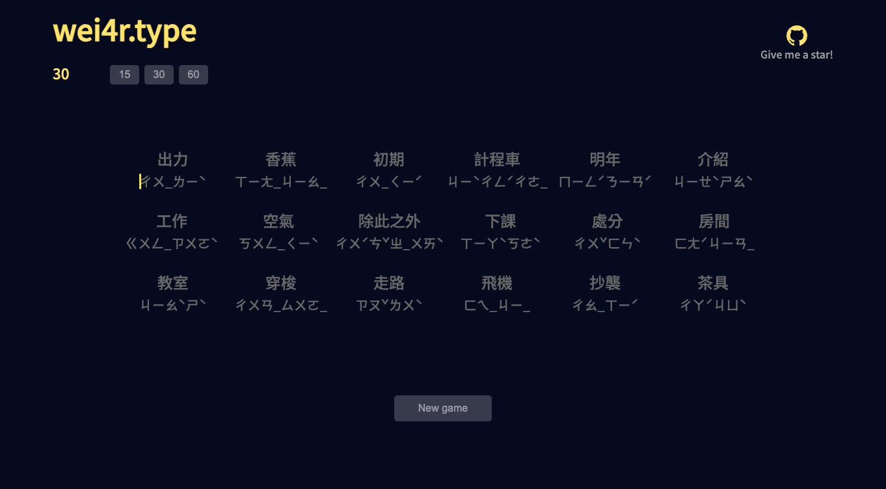
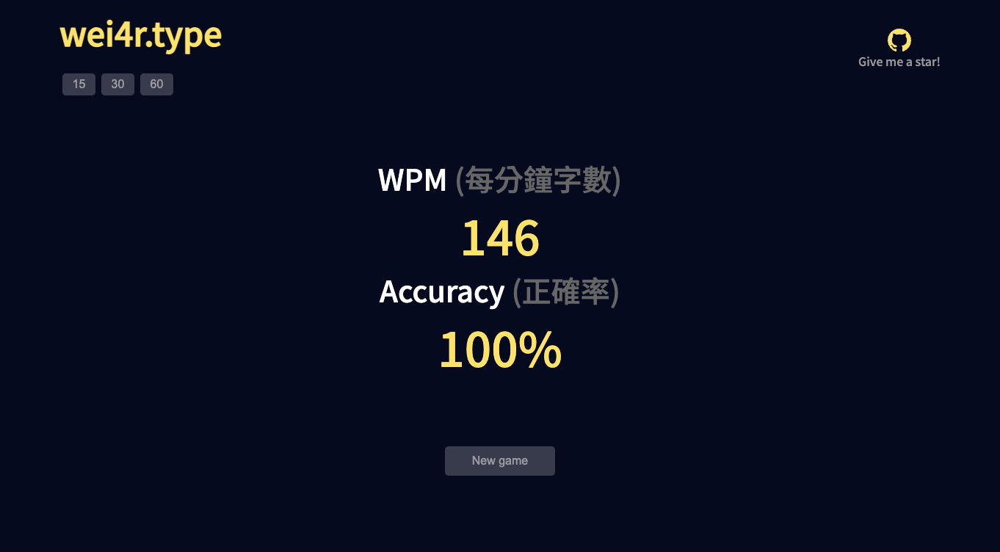

# wei4r.type
## 注音 (Zhuyin) Typing Game

A fast-paced typing game for practicing Zhuyin (Bopomofo) input, built with Next.js and TypeScript.

## Overview

This project is a web-based typing game designed to help users improve their Zhuyin (Bopomofo) typing skills. Players are presented with Chinese characters and their corresponding Zhuyin representations, which they must type correctly as quickly as possible within a time limit.

## Screenshots



## Features

- Real-time typing feedback
- Customizable game duration
- Responsive design for various screen sizes
- Score tracking for correct and incorrect inputs
- Dynamic word generation

## Technologies Used

- React(Next.js)
- TypeScript
- CSS Modules

## Getting Started

To run this project locally:

1. Clone the repository
2. Install dependencies:
```bash 
npm install
```
3. Start the development server:
```bash 
npm run dev
```

## How to Play

1. Click on the game area to focus
2. Type the Zhuyin (Bopomofo) representation of the displayed Chinese characters
3. Cursor will move to the next word when current word is finished
4. Complete as many words as possible before the timer runs out

## Contributing

Contributions are welcome! Please feel free to submit a Pull Request.
